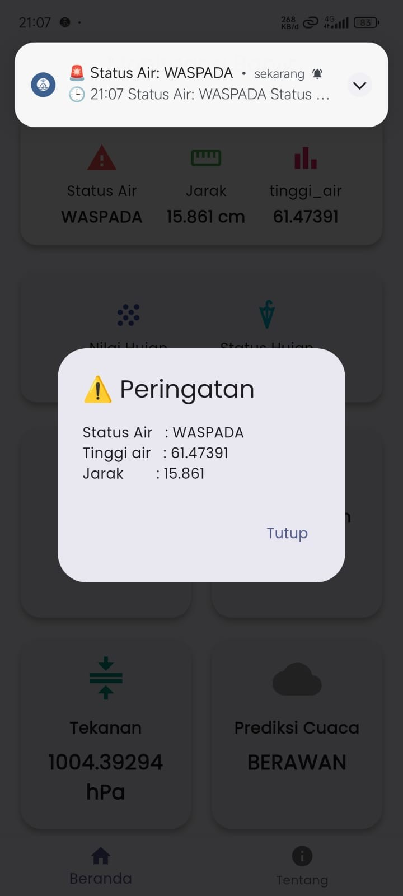
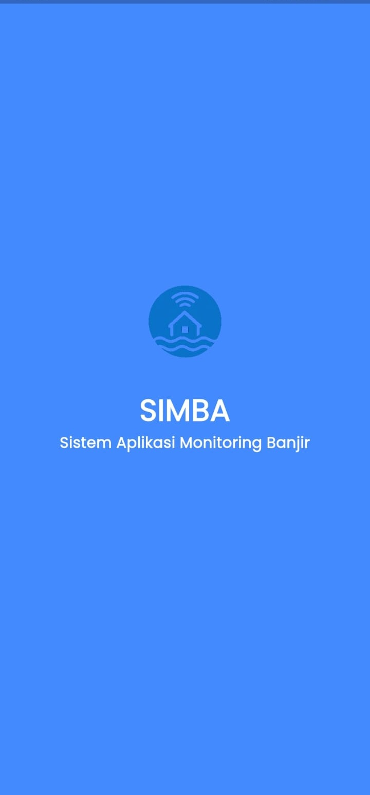
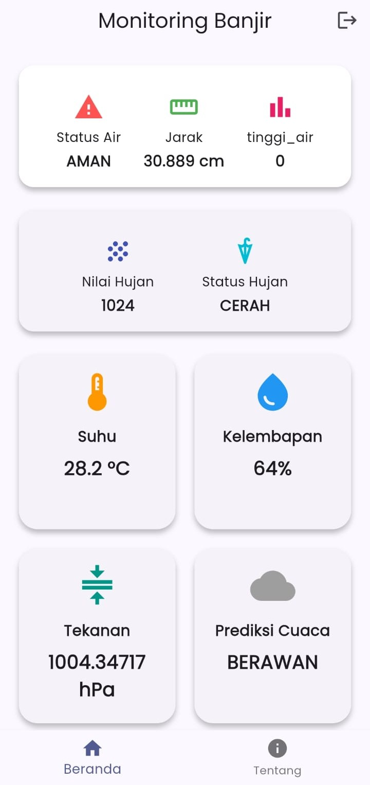
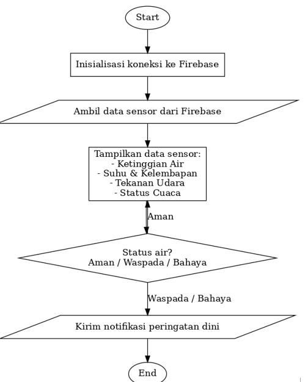

# 🌊SIMBA – Sistem Aplikasi Monitoring Banjir

**SIMBA** adalah aplikasi IoT untuk pemantauan kondisi banjir secara real-time.
Proyek ini menggunakan Flutter (mobile app), Firebase Realtime Database, serta Node.js backend untuk notifikasi ke pengguna melalui Firebase Cloud Messaging (FCM).

---

## ✨ Fitur Utama

- 📡**Realtime Monitoring** : Data sensor (suhu, kelembapan, tekanan, status air, tinggi air, curah hujan) ditampilkan langsung dari Firebase Realtime Database.
- 💾**Cache Data (Offline Support)**: Data terakhir disimpan ke memori lokal dengan SharedPreferences, sehingga tetap terlihat meski offline.
- 🔄**Auto refresh**: status ESP & kartu data update berkala (AJAX).
- 🔔**Notifikasi Otomatis**: Sistem memberi notifikasi dengan suara custom (bahaya.mp3) saat status berubah ke WASPADA atau BAHAYA.
- 🔊**Push Notification (FCM)**: Kirim notifikasi ke topic (peringatan_banjir),Kirim notifikasi ke device spesifik melalui token.
- ⚙️**Backend Node.js**: Service sederhana untuk mengirim alert ke FCM (token / topic).

---

## 🛠️ Teknologi yang Digunakan

### Frontend (Mobile App)
- **Flutter** (Material 3, Google Fonts)
- **Firebase Core** 
- **Firebase Realtime Database** 
- **Firebase Messaging** 
- **Flutter Local Notifications**
- **SharedPreferences**

### Backend
- **Node.js**
- **Firebase Admin SDK**


## 📸 Tampilan Aplikasi

- **Dashboard Monitoring**: menampilkan status air, jarak, tinggi air, suhu, kelembapan, tekanan, curah hujan.
- **Notifikasi**: alert otomatis ketika status berubah.  
- **Halaman Tentang**: deskripsi aplikasi.
<p align="left">
  
  
  
</p>

---

## Alur kerja Sistem
<p align = "left">
  

## Code ESP 32
untuk codenya bisa didownload di download di link dibawah ini
```
https://github.com/IkhsanDS/ESP8266-SIMBA
```
